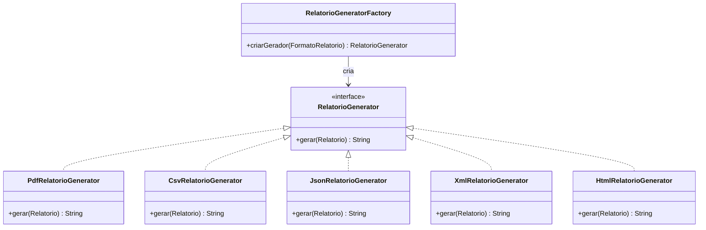
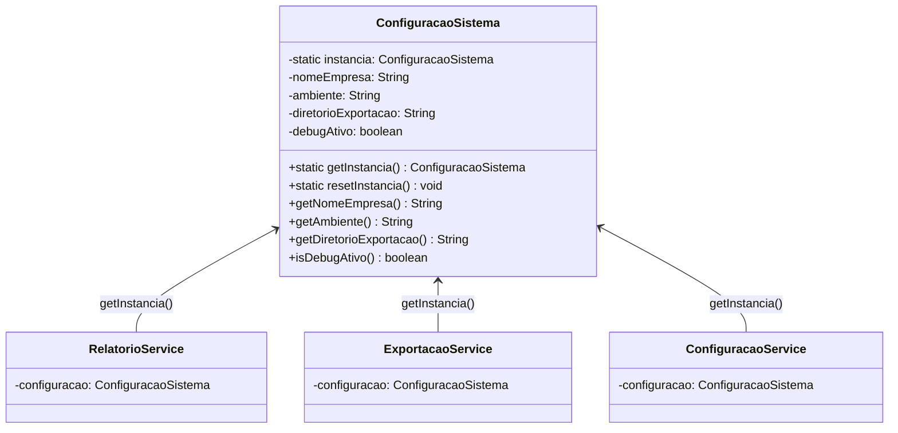

# Sistema de Relatórios Corporativos — Refatorado

> Atividade Prática — Padrões Criacionais de Projeto  
> Disciplina: Padrões de Projeto de Software | Faculdade de Tecnologia — Unicamp

---

## Sobre o sistema

Este repositório contém o código-fonte de um sistema interno de geração e exportação de relatórios corporativos desenvolvido para uma empresa fictícia. O sistema permite gerar relatórios de vendas, estoque e clientes nos formatos PDF, CSV, JSON, XML e HTML, com suporte a configurações globais de ambiente.

O sistema foi refatorado utilizando padrões de projeto para resolver problemas arquiteturais e de manutenibilidade da versão legada.

---

## Objetivo da atividade

Esta atividade propõe uma **refatoração arquitetural** do sistema, com foco na aplicação de padrões criacionais de projeto. O sistema atual, embora funcional, apresenta características típicas de código legado que dificultam sua manutenção e evolução.

Vocês deverão analisar o código existente, identificar os aspectos que dificultam a extensibilidade e a manutenção, e propor e implementar uma solução utilizando os padrões **Factory Method** e **Singleton**.

---

## Pré-requisitos

- Java 17 ou superior
- Apache Maven 3.8 ou superior

---

## Como executar

Compilar e empacotar:

```bash
mvn clean package -q
```

Executar o sistema interativo:

```bash
java -jar target/sistema-relatorios.jar
```

Alternativamente, sem gerar o JAR:

```bash
mvn exec:java -Dexec.mainClass="br.unicamp.padroescriacionais.legacy.Main"
```

---

## Como rodar os testes

```bash
mvn test
```

Para exibir o resultado detalhado de cada caso de teste:

```bash
mvn test -Dsurefire.useFile=false
```

---

# Relatório Técnico — Refatoração com Padrões Criacionais

**Disciplina:** SI405 — Padrões de Projeto  
**Instituição:** Faculdade de Tecnologia — Unicamp  
**Data:** 12 de maio de 2026  

---

## 1. Análise dos Principais Problemas Arquiteturais Identificados

Após análise criteriosa do código legado, foram identificados os seguintes problemas arquiteturais:

### 1.1 Dispersão da Lógica de Criação de Objetos

Os geradores de relatório (`PdfRelatorioGenerator`, `CsvRelatorioGenerator`, `JsonRelatorioGenerator`) eram instanciados diretamente dentro dos serviços por meio de blocos `switch/case` e `if/else-if`:

- Em `RelatorioService.gerarRelatorio()` — cadeia de `if/else-if` com `new PdfRelatorioGenerator()`, `new CsvRelatorioGenerator()`, `new JsonRelatorioGenerator()`
- Em `ExportacaoService.exportar()` — `switch/case` com a mesma lógica duplicada

Isso significava que **a lógica de criação estava replicada em dois locais distintos**, violando o princípio DRY (Don't Repeat Yourself) e o Princípio da Responsabilidade Única (SRP).

### 1.2 Alto Acoplamento entre Serviços e Implementações Concretas

Tanto `RelatorioService` quanto `ExportacaoService` dependiam diretamente das classes concretas dos geradores. Não havia nenhuma abstração (interface ou classe abstrata) unificando os geradores, o que:

- Impedia a substituição de implementações sem modificar os serviços
- Dificultava a adição de novos formatos (cada novo formato exigia alteração em múltiplos arquivos)
- Impossibilitava injeção de dependência e testes com mocks

### 1.3 Instâncias Inconsistentes de Configuração

O problema mais sutil e de maior impacto identificado: **cada serviço criava sua própria instância de `ConfiguracaoSistema` com valores diferentes**:

| Serviço | Empresa | Ambiente | Diretório | Debug |
|---|---|---|---|---|
| `RelatorioService` | "Empresa XPTO" | "DEV" | "/tmp/relatorios" | `false` |
| `ExportacaoService` | "Empresa XPTO Ltda." | "PROD" | "/var/exports/relatorios" | `false` |
| `ConfiguracaoService` | "Empresa XPTO Ltda." | "DEV" | "/tmp/relatorios" | `true` |

Isso violava a premissa de que configurações globais devem ser **únicas e consistentes** em toda a aplicação. Uma alteração de ambiente em um serviço não se refletia nos demais.

### 1.4 Falta de Extensibilidade

A inexistência de uma interface comum para os geradores e a dispersão da criação por `switch/case` tornavam a adição de um novo formato de relatório um processo trabalhoso e propenso a erros, exigindo alterações em pelo menos 3 arquivos.

---

## 2. Justificativa das Decisões Arquiteturais

### 2.1 Por que Factory Method?

O padrão **Factory Method** foi escolhido porque os problemas identificados (duplicação de lógica de criação, alto acoplamento com classes concretas, dificuldade de extensão) são exatamente os cenários clássicos que esse padrão resolve:

- **Centraliza a decisão de criação** em um único local (`RelatorioGeneratorFactory`)
- **Desacopla os serviços** das implementações concretas por meio da interface `RelatorioGenerator`
- **Facilita extensão**: adicionar um novo formato requer apenas criar a classe geradora e adicionar uma linha na fábrica

### 2.2 Por que Singleton?

O padrão **Singleton** foi escolhido para `ConfiguracaoSistema` porque:

- A configuração do sistema representa um **recurso compartilhado** que deve ser globalmente consistente
- Múltiplas instâncias com valores divergentes é um defeito real (já presente no código legado)
- O Singleton garante **ponto único de acesso** e **unicidade da instância**

### 2.3 Decisão de Manter o Construtor Público

O construtor público de `ConfiguracaoSistema` foi mantido por dois motivos:

1. **Compatibilidade retroativa**: os testes legados criam instâncias independentes para testar getters/setters
2. **Flexibilidade**: permite cenários de teste onde configurações isoladas são necessárias

A unicidade é garantida pelo método `getInstancia()` para uso na aplicação, enquanto o construtor serve para testes e cenários excepcionais.

---

## 3. Explicação da Aplicação do Factory Method

### 3.1 Estrutura Implementada



### 3.2 Componentes Criados

1. **`RelatorioGenerator`** (interface) — contrato comum com o método `gerar(Relatorio): String`
2. **`RelatorioGeneratorFactory`** — fábrica centralizada com o método `criarGerador(FormatoRelatorio)`
3. **`XmlRelatorioGenerator`** — novo gerador com escape de caracteres especiais XML
4. **`HtmlRelatorioGenerator`** — novo gerador com estrutura HTML5 completa

### 3.3 Refatoração nos Serviços

**Antes (RelatorioService):**
```java
if (formato == FormatoRelatorio.PDF) {
    PdfRelatorioGenerator generator = new PdfRelatorioGenerator();
    return generator.gerar(relatorio);
} else if (formato == FormatoRelatorio.CSV) {
    CsvRelatorioGenerator generator = new CsvRelatorioGenerator();
    return generator.gerar(relatorio);
} else if (formato == FormatoRelatorio.JSON) {
    // ...
}
```

**Depois (RelatorioService):**
```java
RelatorioGenerator generator = generatorFactory.criarGerador(formato);
return generator.gerar(relatorio);
```

A mesma simplificação foi aplicada ao `ExportacaoService`, eliminando completamente o bloco `switch/case`.

---

## 4. Explicação da Aplicação do Singleton

### 4.1 Estrutura Implementada



### 4.2 Implementação

- **Campo estático privado** `instancia` armazena a referência única
- **Inicialização preguiçosa** (*lazy initialization*) no método `getInstancia()`
- **Método `resetInstancia()`** para permitir isolamento em testes automatizados
- **Construtor público preservado** para compatibilidade com testes legados

### 4.3 Resultado

**Antes:** três instâncias independentes com valores divergentes (nomes de empresa diferentes, ambientes diferentes, diretórios diferentes).

**Depois:** todos os serviços compartilham exatamente a mesma instância via `ConfiguracaoSistema.getInstancia()`, garantindo consistência global.

---

## 5. Impactos da Refatoração na Organização e Extensibilidade do Sistema

### 5.1 Resumo Quantitativo

| Métrica | Antes | Depois |
|---|---|---|
| Formatos suportados | 3 (PDF, CSV, JSON) | 5 (+ XML, HTML) |
| Pontos de criação de geradores | 2 (duplicados) | 1 (fábrica centralizada) |
| Instâncias de configuração | 3 (inconsistentes) | 1 (Singleton) |
| Testes automatizados | 23 | 60 |
| Arquivos de teste | 3 | 6 |

### 5.2 Impacto na Extensibilidade

**Adicionar um novo formato de relatório agora requer apenas:**

1. Criar a classe geradora implementando `RelatorioGenerator`
2. Adicionar o valor ao enum `FormatoRelatorio`
3. Adicionar uma linha na fábrica `RelatorioGeneratorFactory`

Nenhum serviço (`RelatorioService`, `ExportacaoService`) precisa ser modificado, pois eles dependem apenas da interface.

### 5.3 Impacto na Manutenção

- **Redução de duplicação**: a lógica de criação de geradores existe em apenas um local
- **Consistência de configuração**: impossibilidade de ter ambientes divergentes entre serviços
- **Código mais legível**: os serviços delegam a criação e focam na lógica de negócio
- **Testabilidade**: a interface permite substituição por mocks em testes unitários

### 5.4 Princípios SOLID Aplicados

| Princípio | Aplicação |
|---|---|
| **SRP** | A fábrica é responsável exclusivamente pela criação; os serviços focam na lógica de negócio |
| **OCP** | Novos formatos podem ser adicionados sem modificar os serviços existentes |
| **DIP** | Os serviços dependem da abstração `RelatorioGenerator`, não das classes concretas |

### 5.5 Testes Adicionados

- **`RelatorioGeneratorFactoryTest`** (22 testes) — comportamento da fábrica, geradores XML e HTML, integração
- **`SingletonConfiguracaoTest`** (8 testes) — unicidade, valores padrão, reset, compartilhamento entre serviços
- **`ExportacaoNovosFormatosTest`** (7 testes) — exportação nos formatos XML e HTML

---

## 6. Arquivos Modificados e Criados

### Arquivos Criados
- `generator/RelatorioGenerator.java` — interface dos geradores
- `generator/RelatorioGeneratorFactory.java` — fábrica centralizada
- `generator/XmlRelatorioGenerator.java` — gerador XML
- `generator/HtmlRelatorioGenerator.java` — gerador HTML
- `test/.../RelatorioGeneratorFactoryTest.java` — testes da fábrica e novos formatos
- `test/.../SingletonConfiguracaoTest.java` — testes do Singleton
- `test/.../ExportacaoNovosFormatosTest.java` — testes de exportação novos formatos

### Arquivos Modificados
- `domain/ConfiguracaoSistema.java` — adição do padrão Singleton
- `domain/FormatoRelatorio.java` — adição de XML e HTML
- `generator/PdfRelatorioGenerator.java` — implementa `RelatorioGenerator`
- `generator/CsvRelatorioGenerator.java` — implementa `RelatorioGenerator`
- `generator/JsonRelatorioGenerator.java` — implementa `RelatorioGenerator`
- `service/RelatorioService.java` — uso da fábrica e Singleton
- `service/ExportacaoService.java` — uso da fábrica e Singleton
- `service/ConfiguracaoService.java` — uso do Singleton
- `Main.java` — menu atualizado com novos formatos
